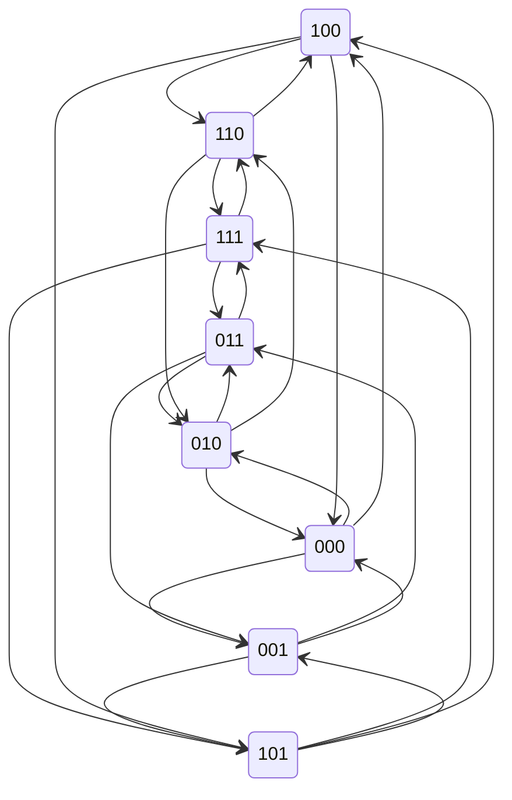

//

stateDiagram
    0000
		0000-->0001
			0001-->0011
				0011-->0111
				0011-->1011
				0011-->0010
			0001-->0101
				0101-->0111
				0101-->1101
				0101-->0100
			0001-->1001
				1001-->1101
				1001-->1011
				1001-->1000
		0000-->0010
			0010-->0011
			0010-->0110
			0010-->1010
		0000-->0100
			0100-->0110
			0100-->1100
			0100-->0101
		0000-->1000
			1000-->1100
			1000-->1010
			1000-->1001
//